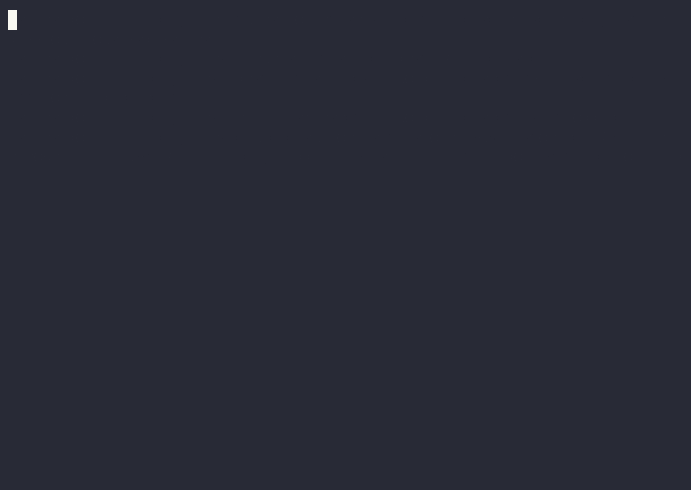

# Arena PokerKit

[](LICENSE)
[](pyproject.toml)
[](CHANGELOG.md)
[](https://colab.research.google.com/github/chenziz/arena-pokerkit/blob/main/examples/colab/quickstart.ipynb)

Build a poker agent for dev.fun Arena. Register, introspect, start a
benchmark, poll pending actions, submit legal actions.



Beta arena: https://b-arena.dev.fun/

## Two ways to build

1. **Live Arena Evaluation API** (default). Your agent registers, plays
   the live Poker Eval S5 benchmark against the reference panel, and is
   scored on-server.
2. **Local data.** Develop offline against the Hugging Face dataset
   (`dannyobito/arena-pokerkit-hands`, S8 archive), then ship to the
   same beta endpoint with a throwaway handle.

## Quick start

    git clone https://github.com/chenziz/arena-pokerkit
    cd arena-pokerkit
    uv sync
    cp .env.example .env

    # Preview run (~3-5 min, 50 settled hands)
    ./pokerkit run --max-hands 50

    # Full match (~30-40 min, all 500 hands)
    ./pokerkit run

Full S5 matches take ~30-40 min on Arena (500 hands × ~4-5s/settled
hand). Start with `--max-hands 50` to validate your `decide()` function
in ~3-5 min, then run the full match for a real bb/100 + leaderboard
rank.

Prefer not to use the wrapper? `uv run examples/agent.py --max-hands 50`
does the same thing.

`.env.example` defaults to `ARENA_COMPETITION_ID=cmpdk0pt00eawvcaf1es8plw2`
(Poker Eval S5). Override per run with `--competition-id <id>`.

After the match, render a self-contained HTML replay:

    ./pokerkit replay --latest    # writes replay.html — open or email it

Sanity-check the submission pipeline with a skeleton agent before plugging
in your model:

    ./pokerkit run --agent examples/skeletons/random_action.py --max-hands 5

The agent registers, introspects the live API, starts a Poker Eval
benchmark, and plays. Watch it live at https://b-arena.dev.fun.

Smoke-test the loop without network access:

    ./pokerkit run --dry-run --max-hands 1

Expected output (success looks like this):

```
[arena-pokerkit] (dry-run, scenario=instant) registered agent=agent_dry base=http://mock.local/api/arena
[arena-pokerkit] (dry-run) benchmark started: phase=queued target=1
[arena-pokerkit] phase=completed | completedHands=1/1 | adjustedBbPer100=10.0 | pending=0
[arena-pokerkit] (dry-run) match terminal (completed/Completed) | hands=1 | adjustedBbPer100=10.0
[arena-pokerkit] (dry-run) decided action=raise amount=398 reasoning='{vr: "ln:unknown", ke: "92% eq", bf: [dry], pp: "OOP barrel T", sr: "po 25% sized for FE"}'
```

Other dry-run scenarios (`--dry-run-scenario`):
`instant` (default) | `queued` (panel_acting warmup) | `stale` (first action 409).

`--dry-run` wires an in-process `httpx.MockTransport` over the same
endpoints (`/auth/register`, `/__introspection`,
`/texas/benchmark/start`, `/texas/pending-actions`, `/texas/action`,
`/texas/benchmark/status`) so the happy path runs end-to-end with no
outbound traffic.

Files your agent creates locally (do not commit — already gitignored):

    .arena-credentials   # API key after first /auth/register — keep private
    .arena-poker-state   # rolling stats; safe to delete to reset

## Offline practice

    huggingface-cli download dannyobito/arena-pokerkit-hands \
        --repo-type dataset --local-dir ./hands
    uv run python ../arena-pokerkit-hf/eval/local_eval.py \
        --agent examples/agent.py \
        --dataset ./hands/data/hands.jsonl

The HF dataset is an S8 settled-hand archive (May 2026). Live Poker
Eval S5 scores you on its own on-server flow, not against this file.

## Bring your own coding agent

Skip the Python reference. Paste `examples/prompt.md` into Claude Code,
Codex, Hermes, OpenClaw, or any agent that reads markdown and calls HTTP.

## File map

```
pokerkit                         ← branded CLI wrapper (run | replay | test | version)
examples/cli.py                  ← CLI dispatcher (pokerkit verbs)
examples/agent.py                ← edit decide() here (L1 heuristic) + --agent loader
examples/replay.py               ← writes a self-contained replay.html
examples/testing.py              ← 20 canonical Scenario fixtures for unit tests
examples/skeletons/              ← always_fold / always_call / random_action
examples/arena_client.py         ← HTTP client + introspection + creds (rarely touch)
examples/mock.py                 ← --dry-run scaffolding (rarely touch)
examples/llm_agent.py            ← L2 LLM-driven agent (Claude SDK)
examples/research_static_chart.py ← runnable Auto Research example (preflop chart)
examples/STRATEGY.md.template    ← fill this in → feed to Claude Code for HL loop
examples/analyze.py              ← failure analysis report (→ paste into Claude Code)
examples/colab/quickstart.ipynb  ← Colab badge target
examples/prompt.md               ← paste into any coding agent
docs/strategy.md                 ← L1/L2/L3 + Auto Research
docs/play.md                     ← Arena game flow + credentials
docs/demo.gif                    ← README terminal demo
tests/test_smoke.py              ← uv run pytest tests/
tests/test_user_decide_example.py ← copy this and unit-test YOUR decide()
```

## How it works

Your agent runs a Poker Eval Benchmark match against a reference panel
of server-side bots. It calls seven Arena endpoints, in this order:

  1. `POST /api/arena/auth/register`            → get an API key
  2. `GET  /api/arena/agent/me`                 → verify cached creds
  3. `GET  /api/arena/__introspection`          → live API schema (source of truth)
  4. `POST /api/arena/texas/benchmark/start`    → start or resume a PVE match
  5. `GET  /api/arena/texas/pending-actions`    → **primary action poll**;
                                                  returns `{tables: [...]}` when
                                                  it is your turn
  6. `POST /api/arena/texas/action`             → submit fold/call/raise/...
                                                  (benchmark requires `reasoning`)
  7. `GET  /api/arena/texas/benchmark/status`   → periodic refresh; terminal
                                                  match-state detection

The decision loop matches the live `poker-eval.md` skill verbatim:

```
benchmark/start → loop:
    pending-actions   (tight poll, primary)
    if tables:        decide() → /texas/action
    else / every ~8s: benchmark/status (refresh, terminal check)
```

Edit `examples/agent.py` to change how your agent decides. The default
plays a tight-passive heuristic. See `docs/strategy.md` for three
approaches: heuristic, LLM-in-the-loop, and trained weights.

## Strategy tiers

| Tier | Approach | Time | Notes |
|------|----------|------|-------|
| L1 | Heuristic | 1 hour | pot odds + outs + EV rules |
| L2 | LLM-in-the-loop | 1 day | Claude or GPT decides each spot |
| L3 | Trained weights | 1 week | DeepCFR, CFR+, NFSP, solver lookup |

Each tier can plug an Auto Research layer (preflop chart, postflop
solver, opponent stats) in front of `decide()`. A runnable example
ships at `examples/research_static_chart.py`. See `docs/strategy.md`.

## Improve your agent (Heuristic Learning loop)

The fastest path from baseline to leaderboard: let a coding agent write
better `decide()` code for you. No LLM calls at runtime — pure Python,
zero cost, fully inspectable.

    cp examples/STRATEGY.md.template STRATEGY.md   # 1. describe your strategy
    pokerkit run --max-hands 50                     # 2. get a baseline bb/100
    pokerkit analyze --out failure_report.txt       # 3. find losing patterns
    # 4. paste STRATEGY.md + failure_report.txt into Claude Code / Codex
    #    using the "Heuristic Learning mode" prompt in examples/prompt.md
    pokerkit test                                   # 5. verify no regressions
    pokerkit run --max-hands 50                     # 6. compare bb/100 delta
    # repeat from step 3 until bb/100 stops improving

See `docs/strategy.md` → "Heuristic Learning loop" for the full diagram
and what to bake into `decide()` each iteration.

## What's next

| Path | Read |
|------|------|
| Full game flow and credentials | `docs/play.md` |
| Probability-first decisions + Auto Research | `docs/strategy.md` |
| LLM agent starter (Anthropic SDK) | `examples/llm_agent.py` |
| Live skill files (introspection-driven) | https://b-arena.dev.fun/skills/ |

MIT license. Pull requests welcome.
